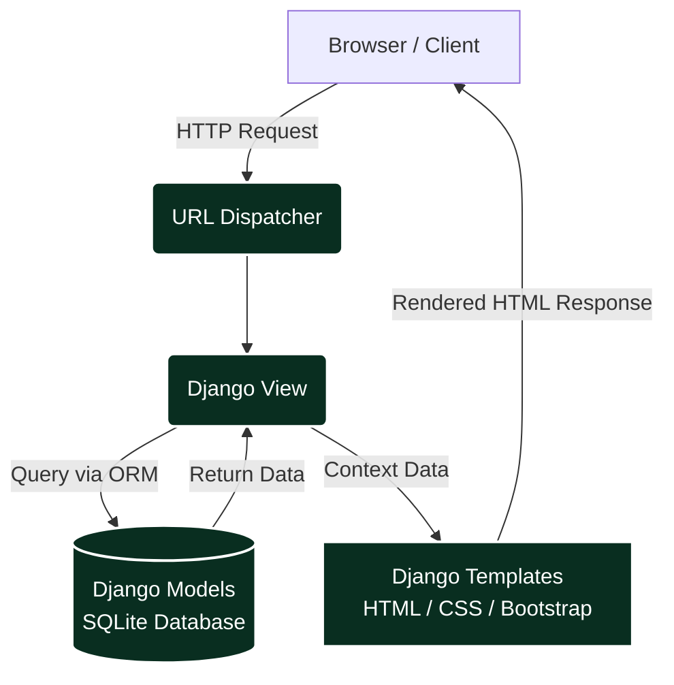

<div align="center">

# 🌐 Full-Stack Django Web Application

A comprehensive full-stack web application built using the Django framework, demonstrating backend server logic, dynamic frontend rendering, and relational database management.

[](https://cognitiveclass.ai/)


[](#)

</div>

---

## 📌 Project Overview

This repository serves as the capstone project for the **IBM Full-Stack Software Developer** curriculum. It demonstrates the end-to-end development of a database-driven web application using **Django**. 

The project showcases the ability to handle user authentication, manage relational data using Django Models, route HTTP requests, and render dynamic content seamlessly using Django Templates and Bootstrap.

---

## 🏗️ Architecture: Model-View-Template (MVT)

This application strictly adheres to Django's standard MVT design pattern to ensure a clean separation of concerns between the database layer, the business logic, and the user interface.

```text
┌─────────────────┐       ┌─────────────────┐       ┌─────────────────┐
│                 │ Request                 │       │                 │
│ Browser / Client│ ──────> URL Dispatcher  │ ──────>   Django View   │
│                 │ <──────                 │ <──────                 │
└─────────────────┘ Response└─────────────────┘       └──────┬───┬──────┘
                                                             │   │
                                          Database Read/Write│   │Context Data
                                                             ▼   ▼
                                        ┌─────────────────┐ ┌───────────────┐
                                        │  Django Models  │ │Django Template│
                                        │ (SQLite/DB logic) │ (HTML / CSS)  │
                                        └─────────────────┘ └───────────────┘
```
This application strictly adheres to Django's standard MVT design pattern to ensure a clean separation of concerns between the database layer, the business logic, and the user interface.



----

## ✨ Key Features Implemented

* **User Authentication:** Secure user registration, login, and logout functionality with role-based access (Instructors vs. Learners).
* **Course & Exam Management:** Instructors can manage courses and lessons. Learners can enroll, view lessons, and take multiple-choice exams.
* **Dynamic Grading & Feedback:** Real-time exam grading with color-coded result displays (correct, wrong, not selected) and tracked submissions per learner.
* **Database Management:** Custom Django Models mapped to a SQLite relational database to store users, courses, and exam entities.
* **Django Admin Integration:** A fully configured superuser dashboard to easily manage database entries via a graphical interface.
* **Responsive UI:** Integration with Bootstrap 4.5 to ensure the application is mobile-friendly and highly accessible.

---

🛠️ Core Tech Stack
## 🛠️ Core Tech Stack

| Category | Technologies Used | Purpose |
| :--- | :--- | :--- |
| **Backend Framework**| Python, Django | Core server logic, routing, and HTTP request handling |
| **Frontend UI** | HTML5, CSS3, Bootstrap | Structuring and styling the user-facing web pages |
| **Database** | SQLite / ORM | Relational data storage managed via Django's ORM |
| **Version Control** | Git, GitHub | Codebase management and continuous tracking |

---

## 📁 Repository Structure
```text
Django-final-project-IBM/
├── myproject/                 # Main Django project configuration folder
│   ├── settings.py            # Global application settings and database config
│   └── urls.py                # Root URL dispatcher
├── onlinecourse/              # Primary application containing business logic
│   ├── migrations/            # Database migration history files
│   ├── templates/             # HTML templates (course details, exams, etc.)
│   ├── admin.py               # Django admin dashboard configuration
│   ├── models.py              # Database schema definitions (ORM)
│   ├── urls.py                # App-level URL routing
│   └── views.py               # Application views and request handling
├── static/                    # Static assets (CSS, admin files, uploaded course images)
├── .gitignore                 # Excluded system and environment files
├── LICENSE                    # Apache 2.0 License
├── manage.py                  # Django command-line utility
├── manifest.yml               # IBM Cloud deployment manifest
├── Procfile                   # Cloud platform execution commands
├── requirements.txt           # Python dependencies
└── README.md                  # Project documentation
```

---

## ⚙️ Local Setup & Execution

# Django Cloud App with Database
Overview
This is a Django-based web application that allows users to explore courses, enroll, take exams, and view results. The app includes user authentication, instructor and learner roles, and dynamic course content management.
The project was developed as part of a full-stack web development course, focusing on cloud-ready applications with database integration.
Features
User Authentication: Registration, login, logout.
Course Management: View courses, lessons, and associated content.
Enrollment: Learners can enroll in courses and track progress.
Exams:
Multiple-choice questions with multiple correct answers
Submissions tracked per learner
Real-time grading and feedback
Color-coded exam result display (correct, wrong, not selected)
Instructor Role: Ability to manage courses and lessons.
Responsive UI: Built with Bootstrap 4.5 for mobile and desktop friendliness.
Technologies Used
Backend: Django 3.x
Frontend: HTML, Bootstrap 4.5, JavaScript, jQuery
Database: SQLite (default for Django)
Version Control: Git, GitHub

**General Notes**

An `onlinecourse` app has already been provided in this repo upon which you will be adding a new assesement feature.

- If you want to develop the final project on Theia hosted by [IBM Developer Skills Network](https://labs.cognitiveclass.ai/), you will need to create the same project structure on Theia workspace and save it everytime you close the browser
- Or you could develop the final project locally by setting up your own Python runtime and IDE
- Hints for the final project are left on source code files
- You may choose any cloud platform for deployment (default is IBM Cloud Foundry)
- Depends on your deployment, you may choose any SQL database Django supported such as SQLite3, PostgreSQL, and MySQL (default is SQLite3)

**ER Diagram**
For your reference, we have prepared the ER diagram design for the new assesement feature.


=======
⚙️ Local Setup & Execution
To run this Django application on your local machine, follow these steps:
1. Clone the Repository
```bash
git clone [https://github.com/HAMED-PAYANDA/Django-final-project-IBM.git](https://github.com/HAMED-PAYANDA/Django-final-project-IBM.git)
cd Django-final-project-IBM
```

2. Install Dependencies
Ensure you have Python installed, then install the required Django packages:
```bash
python3 -m pip install -r requirements.txt
```

3. Apply Database Migrations
Prepare the SQLite database by applying the built-in and custom Django migrations:
```bash
python3 manage.py makemigrations
python3 manage.py migrate
```

4. Create a Superuser (Optional but Recommended)
To access the Django Admin dashboard (/admin), create an administrative account:
```bash
python3 manage.py createsuperuser
```

5. Run the Development Server
Launch the application locally:
```bash
python3 manage.py runserver
```

The application will now be accessible in your web browser at http://127.0.0.1:8000/.

## 📜 General Notes & Deployment
•	Cloud Deployment: This project includes a Procfile and manifest.yml and is configured for deployment on cloud platforms (defaulting to IBM Cloud Foundry).
•	Database Flexibility: While SQLite3 is configured by default for local development, Django's ORM allows seamless transition to PostgreSQL or MySQL for production environments.

---

## License
This project is licensed under the [Apache 2.0 License](LICENSE).

## 👤 Author

**Hamed Payanda**
* **GitHub:** [@HAMED-PAYANDA](https://github.com/HAMED-PAYANDA)
* Completed as part of the **IBM Full-Stack Software Developer Professional**.


